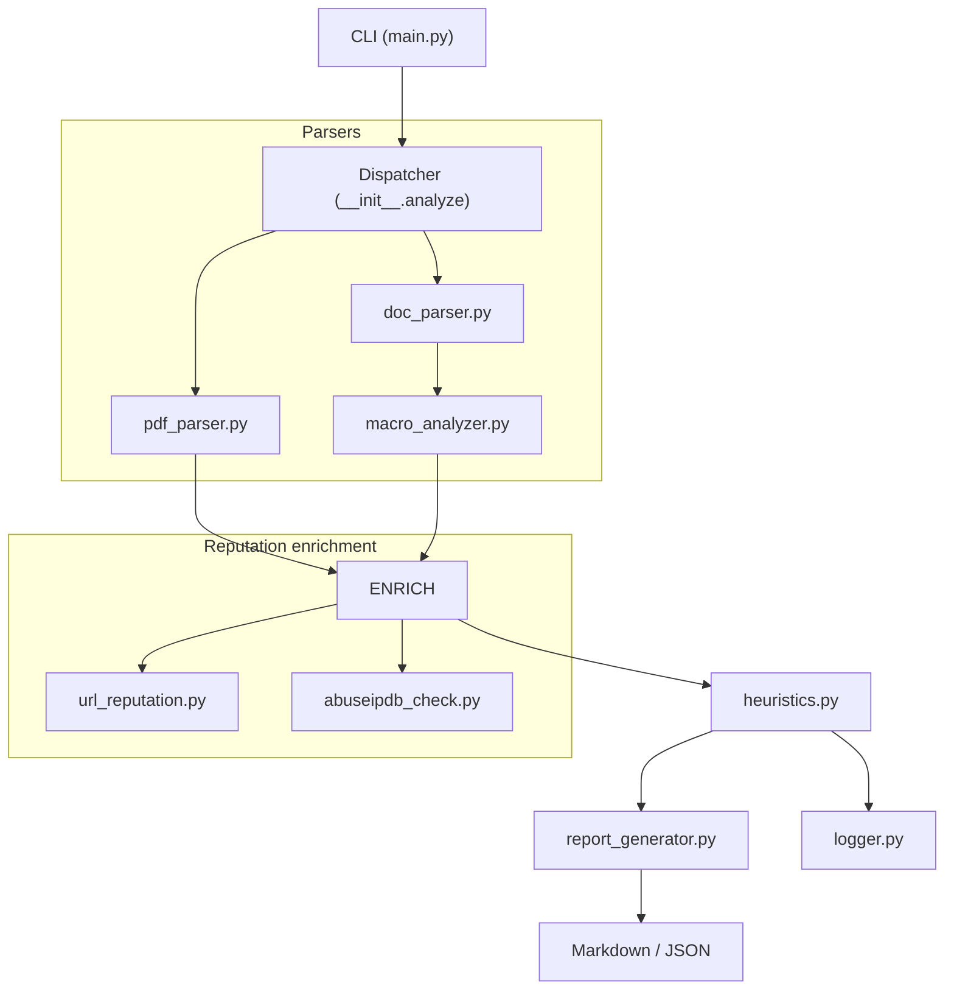

# IOC Inspector 🕵️‍♂️
[](https://github.com/PKHarsimran/IOC-Inspector/actions/workflows/ci.yml)
[](https://github.com/PKHarsimran/IOC-Inspector/actions/workflows/lint.yml)  
[](https://codecov.io/gh/PKHarsimran/IOC-Inspector)
[](LICENSE)


**Fast, SOC-ready malicious-document scanner** — turn suspicious PDFs, DOC(X), XLS(X) & RTFs into IOC-rich, SIEM-friendly reports.

---

## ✅ What's New
- Cross-platform CI with **Linux + Windows** and **Python 3.10/3.11** support
- Improved parser error handling with custom `ParserError`
- Dynamic API key loading for test reliability
- Coverage-gated CI with **>80%** unit test coverage
- Final README polish ✨

---

## ⚡ Why IOC Inspector?

| 🔑 | Value to Analysts |
|----|------------------|
| **One-command triage** | `ioc-inspector invoice.docx` → instant verdict & Markdown report |
| **Actionable scoring** | Custom heuristics blend macro flags, **auto-exec/API hits**, embedded-object metrics and threat-feed look-ups (VirusTotal + AbuseIPDB) into a **0-100 risk score** |
| **Analyst-first outputs** | Markdown for tickets, JSON / CSV for Splunk & Elastic |
| **Runs anywhere** | Linux • Windows • headless in GitHub Actions |
| **Extensible** | All logic lives in `ioc_inspector_core/` — swap parsers, add feeds, tweak weights |

---

## 🔍 Feature Matrix

| Category            | What you get                                                                                      |
|---------------------|----------------------------------------------------------------------------------------------------|
| **Formats**         | PDF • DOC / DOCX • XLS / XLSX • RTF                                                                |
| **Static Analysis** | Macro dump, **deep auto-exec & suspicious-API analysis**, obfuscation finder, embedded-object counter |
| **IOC Extraction**  | URLs • Domains • IPs • Base64 blobs • Hidden links                                                 |
| **Threat Enrichment** | VirusTotal • AbuseIPDB                                                                      |
| **Scoring Engine**  | Heuristic weights + rule modifiers (configurable)                                                  |
| **Reporting**       | Markdown & JSON (CSV optional)                                                                     |
| **Automation**      | Dir-recursive scan • Quiet / Verbose switches • GitHub Actions workflow                            |

---

## 🚀 Quick Start

```bash
# 1 – Clone
$ git clone https://github.com/PKHarsimran/IOC-Inspector.git
$ cd IOC-Inspector

# 2 – Install (Linux/macOS)
$ python -m venv venv && source venv/bin/activate

# 2 – Install (Windows)
> python -m venv venv && venv\Scripts\activate

# 3 – Install requirements
(venv) $ pip install -r requirements.txt

# 4 – Set up API keys
(venv) $ cp .env.example .env
(venv) $ nano .env    # Add your VT_API_KEY & ABUSEIPDB_API_KEY

# 5 – Run
(venv) $ python main.py --file examples/sample_invoice.docx --report
```

<details><summary>Example Output</summary>
examples/sample_invoice.docx: score=45 verdict=suspicious  
See reports/sample_invoice_report.md for full IOC tables.
</details>

---

## ⚙️ Configuration Highlights (settings.py)
```python
RISK_WEIGHTS = {
    "macro":          25,   # any VBA present
    "autoexec":       15,   # AutoOpen / Document_Open …
    "obfuscation":    20,   # long Base-64 blobs, XOR strings
    "susp_call":       5,   # CreateObject, Shell … (×3 capped at 15)
    "malicious_url":  30,   # VirusTotal consensus
    "malicious_ip":   25,   # AbuseIPDB ≥ confidence cutoff
}

VT_THRESHOLD            = 5    # vendors that must flag URL/IP malicious
ABUSE_CONFIDENCE_CUTOFF = 70   # AbuseIPDB confidence to flag IP
REPORT_FORMATS          = ["markdown", "json"]
```

🗂️ Repository Layout
```text
ioc-inspector/
├── ioc_inspector_core/         ← all analysis logic
│   ├── __init__.py
│   ├── pdf_parser.py
│   ├── doc_parser.py
│   ├── macro_analyzer.py       ← deep VBA heuristics
│   ├── url_reputation.py
│   ├── abuseipdb_check.py
│   ├── heuristics.py
│   └── report_generator.py
│
├── logger.py
├── main.py
├── settings.py
│
├── examples/
├── reports/        (git-ignored)
├── logs/           (git-ignored)
│
├── tests/
└── requirements.txt
```
---

## 📦 Dependencies at a Glance

| Category | Package | Why it’s needed |
|----------|---------|-----------------|
| Core     | `oletools`, `pdfminer.six`, `PyMuPDF`, `requests`, `python-dotenv`, `tldextract` | Parsing, enrichment, API config |
| Reporting| *(builtin)* | Markdown/JSON rendering |
| Optional | `tabulate`, `rich`, `jinja2` | Pretty console output, HTML reports |

---

### 🗺️ How the code flows



**What happens step-by-step**

| Stage | Module | Job |
|-------|--------|-----|
| **CLI** | `main.py` | Reads flags, builds file list, prints a headline. |
| **Dispatcher** | `ioc_inspector_core/__init__.py` | Routes each file to the right parser. |
| **Parsers** | `pdf_parser.py` & `doc_parser.py` | Extract URLs, IPs, macros, embeds, JavaScript. |
| **Enrichment** | `url_reputation.py`, `abuseipdb_check.py` | Query VirusTotal & AbuseIPDB; attach verdicts. |
| **Scoring** | `heuristics.py` | Apply weights, produce 0-100 risk score & verdict. |
| **Reporting** | `report_generator.py` | Write Markdown + JSON with IOC tables. |
| **Logging** | `logger.py` | Console + rotating file breadcrumbs for every stage. |

---

## 📊 Coverage & Reliability
- ✅ **>80% test coverage** (enforced in CI)
- ✅ Coverage badge + reports via Codecov
- ✅ Works on **Linux and Windows** runners
- ✅ CLI smoke test validates API usage and report generation

---

## ➡️ Pathway

| Stage        | Still to do before the next stage |
|--------------|-----------------------------------|
| **pre-0.1**  | Completed |
| **0.1**      | Dependency-pinned CLI with Markdown / JSON output and a passing test-suite - Completed |
| **0.2**      | Optional CSV export · Docker image · extra threat-feed look-ups |
| **1.0**      | Performance tuning · full docs · stable config & semantic versioning |

---

## 👋 Contributing
Pull requests are welcome! For ideas, check the [issues](https://github.com/PKHarsimran/IOC-Inspector/issues).

---
