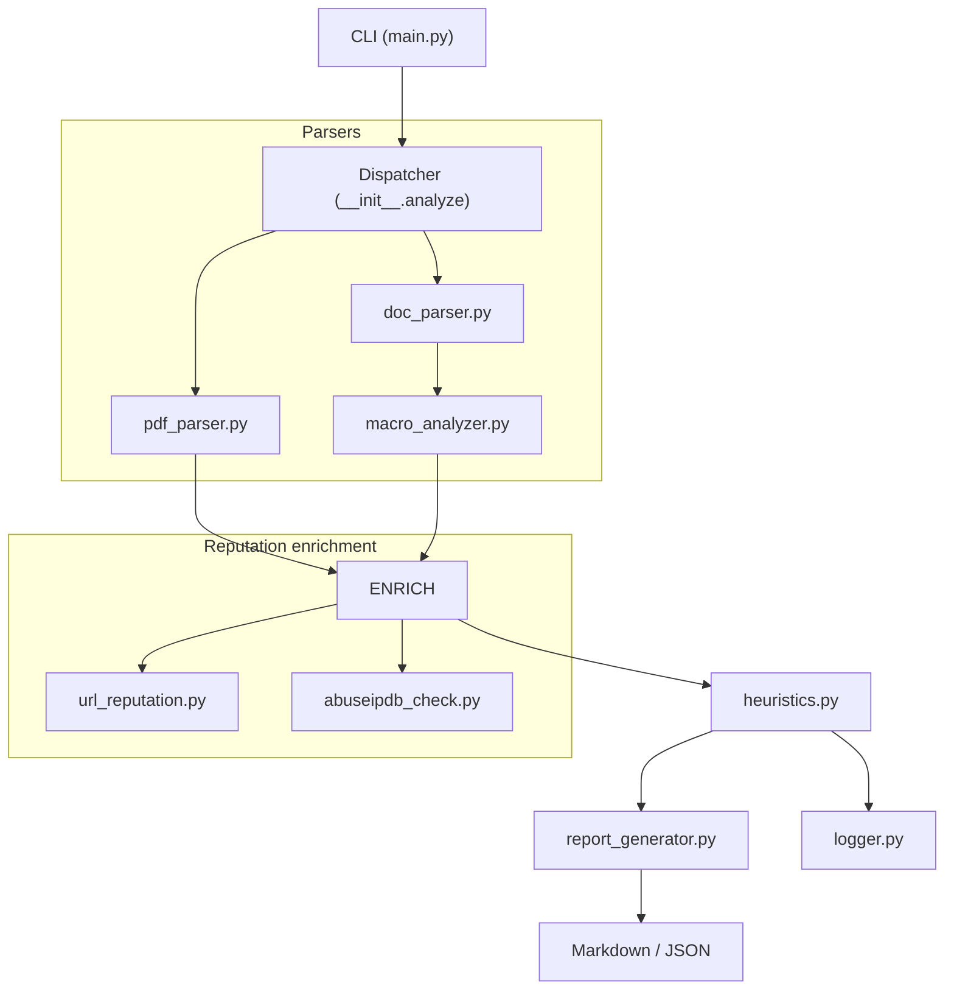

# IOC Inspector 🕵️‍♂️
[](https://github.com/PKHarsimran/IOC-Inspector/actions/workflows/ci.yml)  
[](https://github.com/PKHarsimran/IOC-Inspector/actions/workflows/lint.yml)  
[](https://codecov.io/gh/PKHarsimran/IOC-Inspector)
[](LICENSE)


**Fast, SOC-ready malicious-document scanner** — turn suspicious PDFs, DOC(X), XLS(X) & RTFs into IOC-rich, SIEM-friendly reports.

---

## ⚡ Why IOC Inspector?

| 🔑 | Value to Analysts |
|----|------------------|
| **One-command triage** | `ioc-inspector invoice.docx` → instant verdict & Markdown report |
| **Actionable scoring** | Custom heuristics blend macro flags, **auto-exec/API hits**, embedded-object metrics and threat-feed look-ups (VirusTotal + AbuseIPDB) into a **0-100 risk score** |
| **Analyst-first outputs** | Markdown for tickets, JSON / CSV for Splunk & Elastic |
| **Runs anywhere** | Linux • macOS • Windows • headless in GitHub Actions |
| **Extensible** | All logic lives in `ioc_inspector_core/` — swap parsers, add feeds, tweak weights |

---

## 🔍 Feature Matrix

| Category            | What you get                                                                                      |
|---------------------|----------------------------------------------------------------------------------------------------|
| **Formats**         | PDF • DOC / DOCX • XLS / XLSX • RTF                                                                |
| **Static Analysis** | Macro dump, **deep auto-exec & suspicious-API analysis**, obfuscation finder, embedded-object counter |
| **IOC Extraction**  | URLs • Domains • IPs • Base64 blobs • Hidden links                                                 |
| **Threat Enrichment** | VirusTotal • AbuseIPDB (URLScan optional)                                                       |
| **Scoring Engine**  | Heuristic weights + rule modifiers (configurable)                                                  |
| **Reporting**       | Markdown & JSON (CSV optional)                                                                     |
| **Automation**      | Dir-recursive scan • Quiet / Verbose switches • GitHub Actions workflow                            |

---

## 🗺️  How It Works

```text
main.py (CLI)
   │
   ▼
ioc_inspector_core.__init__.analyze()
   ├─► pdf_parser.py      (if .pdf)
   ├─► doc_parser.py      (if Office/RTF)
   │     └─► macro_analyzer.py   ← NEW deep VBA heuristics
   │
   ├─► url_reputation.py  (VirusTotal)
   ├─► abuseipdb_check.py (AbuseIPDB)
   ▼
heuristics.py   →  score + verdict
   ▼
report_generator.py → Markdown / JSON
   ▼
logger.py  →  stdout + ./logs/ioc_inspector.log
```

## 🚀 Quick Start
```bash
# 1 – Clone
git clone https://github.com/PKHarsimran/IOC-Inspector.git
cd IOC-Inspector

# 2 – Install
python -m venv venv && source venv/bin/activate   # Windows: venv\Scripts\activate
pip install -r requirements.txt

# 3 – Configure APIs
cp .env.example .env
nano .env                      # add VT_API_KEY & ABUSEIPDB_API_KEY

# 4 – Scan a file
python main.py --file examples/sample_invoice.docx --report
```

<details> <summary>Example output</summary>
examples/sample_invoice.docx: score=45 verdict=suspicious
See reports/sample_invoice_report.md for full IOC tables.
</details>

## ⚙️ Configuration Highlights (settings.py)
```python
RISK_WEIGHTS = {
    "macro":          25,   # any VBA present
    "autoexec":       15,   # AutoOpen / Document_Open …
    "obfuscation":    20,   # long Base-64 blobs, XOR strings
    "susp_call":       5,   # CreateObject, Shell … (×3 capped at 15)
    "malicious_url":  30,   # VirusTotal consensus
    "malicious_ip":   25,   # AbuseIPDB ≥ confidence cutoff
}

VT_THRESHOLD            = 5    # vendors that must flag URL/IP malicious
ABUSE_CONFIDENCE_CUTOFF = 70   # AbuseIPDB confidence to flag IP
REPORT_FORMATS          = ["markdown", "json"]
```

🗂️ Repository Layout
```text
ioc-inspector/
├── ioc_inspector_core/         ← all analysis logic
│   ├── __init__.py
│   ├── pdf_parser.py
│   ├── doc_parser.py
│   ├── macro_analyzer.py       ← deep VBA heuristics
│   ├── url_reputation.py
│   ├── abuseipdb_check.py
│   ├── heuristics.py
│   └── report_generator.py
│
├── logger.py
├── main.py
├── settings.py
│
├── examples/
├── reports/        (git-ignored)
├── logs/           (git-ignored)
│
├── tests/
└── requirements.txt
```
---

## 📦 Dependencies at a Glance

| Category | Package | Why it’s needed |
|----------|---------|-----------------|
| **Core document parsing** | `oletools 0.60.1` | Extract VBA macros & OLE streams from DOC/XLS/RTF |
| | `olefile 0.46` | Low-level helper used by oletools |
| | `pdfminer.six 20231228` | Scrape plain text & objects out of PDFs |
| | `PyMuPDF 1.24.3` | Fast parser for embedded files & JavaScript inside PDFs |
| **IOC extraction & enrichment** | `requests 2.32.3` | Make REST calls to VirusTotal & AbuseIPDB |
| | `python-dotenv 1.0.1` | Load API keys from `.env` without hard-coding secrets |
| | `tldextract 5.1.2` | Split domain / sub-domain / TLD cleanly in URLs |
| **Reporting** | *(built-in Markdown / JSON generators)* | |
| | *Optional* `Jinja2 3.1.4` | Only needed if you later switch to HTML-template reports |
| **CLI niceties (optional)** | `rich 13.7.1` | Colourful console output & progress bars |
| | `tabulate 0.9.0` | Pretty ASCII tables for verbose mode |

> **Tip:** If you just want the core scanner, install with  
> ```bash
> pip install -r requirements.txt
> ```  
> and skip the optional “niceties.”  
> Uncomment them in `requirements.txt` whenever you want fancy console output.

### 🗺️ How the code flows




**What happens step-by-step**

| Stage | Module | Job |
|-------|--------|-----|
| **CLI** | `main.py` | Reads flags, builds file list, prints a headline. |
| **Dispatcher** | `ioc_inspector_core/__init__.py` | Routes each file to the right parser. |
| **Parsers** | `pdf_parser.py` & `doc_parser.py` | Extract URLs, IPs, macros, embeds, JavaScript. |
| **Enrichment** | `url_reputation.py`, `abuseipdb_check.py` | Query VirusTotal & AbuseIPDB; attach verdicts. |
| **Scoring** | `heuristics.py` | Apply weights, produce 0-100 risk score & verdict. |
| **Reporting** | `report_generator.py` | Write Markdown + JSON with IOC tables. |
| **Logging** | `logger.py` | Console + rotating file breadcrumbs for every stage. |

## ➡️ Pathway

| Stage        | Still to do before the next stage |
|--------------|-----------------------------------|
| **pre-0.1** *(current)* | - [ ] Pin library versions in `requirements.txt`<br>- [ ] Add unit tests for PDF & macro branches<br>- [ ] Tighten error handling / logging<br>- [ ] Ensure CI passes on **Linux + Windows**<br>- [ ] Final README polish |
| **0.1**      | Dependency-pinned CLI with Markdown / JSON output and a passing test-suite |
| **0.2**      | Optional CSV export · Docker image · extra threat-feed look-ups |
| **1.0**      | Performance tuning · full docs · stable config & semantic versioning |


### 🏁 Detailed *pre-0.1* Checklist  <sup>(mirrors the task-list in the roadmap)</sup>

| Task | Why it matters | How we’ll achieve it | Done ? |
|------|----------------|----------------------|:------:|
| **Pin library versions** | Reproducible builds – no “works-on-my-machine.” | Freeze every runtime dep in `requirements.txt` with exact versions. Add install step to CI. | Completed |
| **Add unit tests (PDF & macro)** | Catch regressions when parsers change. | Use **pytest**; fixtures: benign PDF & malicious DOCM. Aim for ≥ 80 % coverage. | ⬜ |
| **Tighten error handling / logging** | Fail *loudly* and informatively. | Wrap parser entry-points in `try/except`, raise `ParserError`, add ERROR log + test that checks it. | ⬜ |
| **Cross-OS CI (Linux + Windows)** | Users run both. | Matrix in `.github/workflows/ci.yml`; run tests & collect coverage on both OSes. | ⬜ |
| **Final README polish** | First impression counts. | Add coverage badge, verify quick-start on Win & Linux, remove stale TODOs. | ⬜ |

### 🚀 Post-0.1 Milestones

| Version | Focus | Key deliverables |
|---------|-------|------------------|
| **0.2** | Distribution & scale | • `--csv` export<br>• Alpine-based Docker image<br>• Extra enrichment feed (e.g., URLScan) |
| **0.3** | UX & integrations | • `--quiet` JSON-only mode<br>• Rich CLI progress (opt-in)<br>• Splunk TA skeleton |
| **1.0** | Stability & docs | • Async reputation look-ups for speed<br>• Full Sphinx docs site<br>• Semantic-versioned config<br>• Signed release assets |
